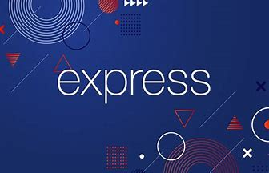
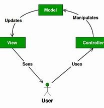
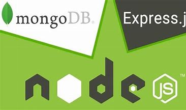

## BLOG APP

This project is a simple Backend Application using express a node js framework. That allows users to signup, log in, create blogs, add blogs, update blogs and delete blogs. Blogs can be saved in two different forms on this app (draft or published). The user can get the blog endpoint, whether the user is been login or not.

#### Getting started:
To get started we need to ensure that we have nodejs running on our local terminal. If we don't have nodejs on our local machine, we need to install it by downloading the latest version of it.

### Note: 
**Create a package.json file by running npm init -y command  on your working terminal**

***Let dive deep .***

###### This project was developed using the MVC design pattern. By creating the Models folder, Routes folder, and Controller folder. With some folders and some single files, which I will explain below. This project has two main routes the blog route and the user route.

The model's folder contains the blog model file and the user model file. Where I created their Schemas and exported them to the controller folder. The blog model Schema contains the blog title, description, author, state[draft or publish], read count, and reading time. 

The Controllers folder contains the blog controller file and the user controller file. Where I imported the model's files too. I created the CRUD method in the controller file.

 

The MVC pattern is not complete without the view folder. But in this case, the view folder is not necessary to create, because we can use some alternatives like Thunder Client and postman as our view. Which I use in my case.

The Route folder is the final stage of my MVC pattern. Where I created my express router and imported the CRUD methods of my blog controller and user controller as a route.

App file , this file serves as the module file for my project .

#### The following dependecies were installed for this project:
- ***nodemon***
- ***bcrypt***
- ***body-parser***
- ***connect-ensure-in***
- ***dotenv***
- ***ejs***
- ***express***
- ***express-session***
- ***jest***
- ***jsonwebtoken***
- ***mongoose***
- ***passport***
- ***passport-jwt***
- ***passport-local***
- ***passport-local-mongoose***
- ***supertest***

***Built with***
- Express: Express is nodejs framework that makes the project to be easy to build using javascript as the programming language.

- Supertest/jest: These npm packages make the development to test the project when needed. Supertest is for integration testing while jest is for unit testing.

- nodemon: This npm package refreshes your project whenever you update it without running the command (nodemon app/server) multiple times.

##### To save time, you can read more on the dependencies. Using their documentation.
Please check out my project by clicking on this link [BLOG APP](https://github.com/anikiyusuf/blog-project/tree/master). You are free to contribute to the project.

#### Code with ❤ by Yusuf Aniki  🤲👨‍💻
##### Happy coding 

